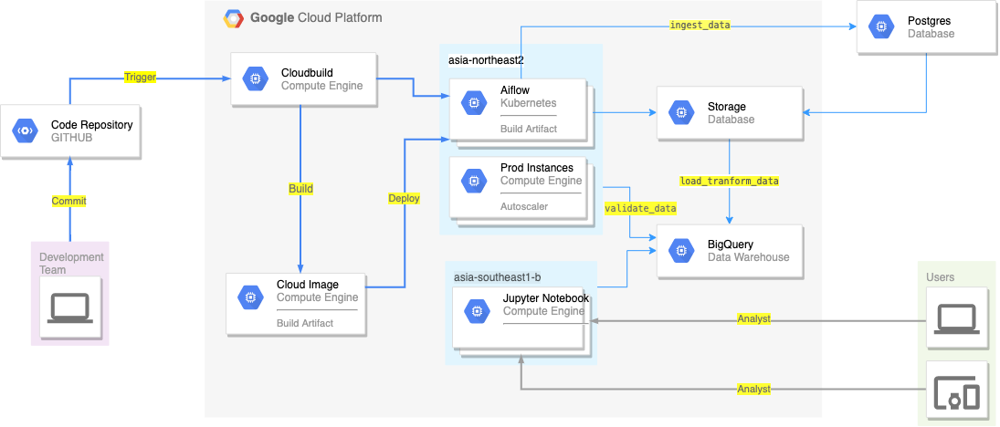

# Exam-bluepi
* All Servivce
    *   Kubernetes Engine (Airflow)
    *   Compute Engine (Jupyter)
    *   CloudBuild (CI/CD)
    *   Storage
    *   BigQuery (Data Warehouse)
    *   Postgres

* Code Structure
```
    .
    ├── credential
    ├── dags
    │   ├── bluepi
    │       ├── crm (project1)
    │       │   ├── env (other config)
    │       │   ├── src (code function)
    │       ├── sale (project2)
    ├── logs
    ├── .gitignore
    ├── airflow.cfg
    ├── cloudbuild
    ├── env_var.json
    ├── README.md
    └── requirements.txt
```

* Architecture
    
    Format: 


